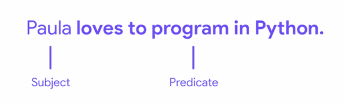
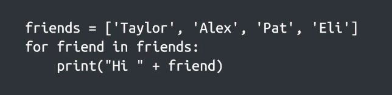
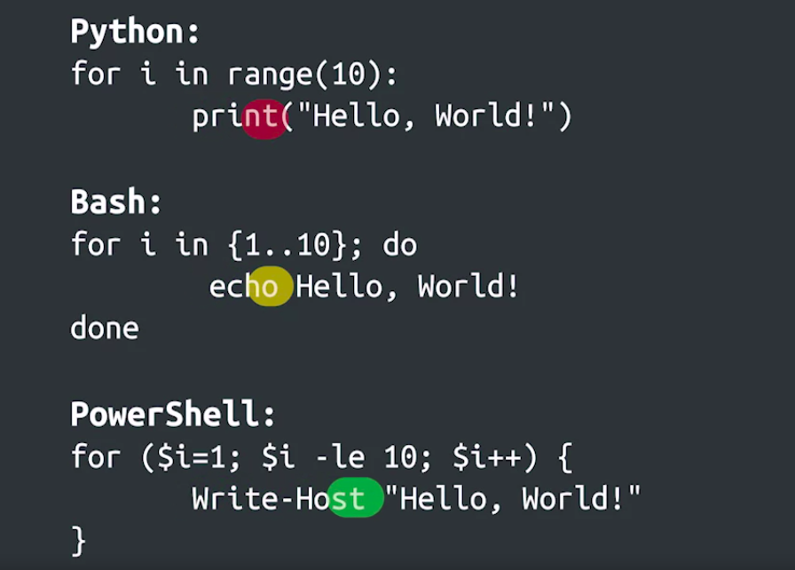

Crash Course on Python
=======================

by Google

# Module 1
#
## Title: Hello Python!

### Introduction to Programming

#### What is Programming?

> Knowing the syntax and understanding the semantics of a programming language allows us to tell the computer what we want it to do

* **Syntax**
	* **Syntax** is the rules for how a sentence is constructed while semantics refers to the actual meaning of the statements
	* In English, sentences generally have both a __subject__ (that's a person, place, or thing) and a __predicate__ usually a verb and a __statement__ that explains what the subject is doing
	* Example
		<p align="center">
		  <a href="javascript:void(0)" rel="noopener">
		 </a>
		</p>
	* In Programming language, **Syntax** is the rules for how each instruction is written
	* **Semantics** is the effect the instructions have
* **Script** is a program that is short, simple, and can be written very quickly
	* **Scripts** - Programs with a short development cycle that can be created and deployed rapidly

#### What is automation?

* **Automation** is the process of replacing a manual step with one that happens automatically
* Example:
	1. Traffic Lights
		* The automatic regulation of traffic means that humans don't have to stand at the intersection manually signaling when cars should stop or go
* Consistency is one of the benefit of automation

#### Getting Computers to Work for You

* Automating tasks allows you to focus on projects that are a better use of your time, letting computers do the boring stuff for you
* Examples
	* Installing and configuring software is a task that can be automated. Ensuring that everyone gets the exact same setup and reducing the amount of manual work needed for each new employee
	* Scanning the disk usage is a task that can be easily automated. By letting the computer do it, you won't have to worry about forgetting to do it whenever it's needed

### Introduction to Python

#### What is Python?

* Python programming language to demonstrate basic programming concepts and how to apply them to writing scripts
* Programming in Python usually feels similar to using a human language. This is because Python makes it easy to express what we want to do with syntax that's easy to read and write
* Example
	<p align="center">
	  <a href="javascript:void(0)" rel="noopener">
	 </a>
	</p>
* In programming, an **interpreter** is the program that reads and executes code
* The Python interpreter is the program that reads what is in the recipe and translates it into instructions for your computer to follow
	* Computer program is like a recipe with step-by-step instructions

> Syntax is the rules of how code is constructed, while semantics are the overall effect the code has
#
> It is possible to have syntactically correct code that runs successfully, but doesn't do what we want it to do.

#### Why is Python relevant to IT?

* Python is relevant to today’s IT industry, cz
	1. Python scripts are easy to write, understand, and maintain
		* Python is a language that tries to mimic our natural language and so Python scripts are generally easy to write, understand and maintain
	1. There are many system administration tools built with Python
		* Over the years, the Python community has developed a lot of additional tools that can be used by system administrators to get their job done
	1. Python is available on a wide variety of platforms
		* Python is available on Windows, Linux, MacOS and even on mobile devices, making it a great tool for IT specialist looking to create scripts that can work across platforms.

#### Other Languages

> Once you know the fundamentals of programming, learning another programming language

* General-purpose scripting languages similar to Python, like __Pearl__ or __Ruby__, which are also widely used for scripting and automation
* Platform-specific scripting languages like
	1. __PowerShell__ which is used on __Windows__
	1. __Bash__ which is used on __Linux__
* __JavaScript__, which was originally developed as a client-side scripting language for the web is increasingly used as server side for a broader set of tasks
* There is vast array of traditional languages to explore like __C__, __C++__, __Java__, or __Go__
* Example
	<p align="center">
	  <a href="javascript:void(0)" rel="noopener">
	 </a>
	</p>

### Hello World

#### Hello, World!

* **Functions** are pieces of code that perform a unit of work
* **Keywords** are reserved words that are used to construct instructions
	* These words are the core part of the language and can only be used in specific ways
	* Example: if, while, and for
* **Keywords** and **Functions** used in Python are what makes up the syntax of the language
* Wrapping text in quotation marks indicates that the text is considered a string, which means it's text that will be manipulated by our script
* In programming, any text that isn't inside quotation marks is considered part of the code
* Example
	```python
	>>> print("Hello, World!")
		Hello, World!
	```

#### Getting Information from the User

* Data can be provided to a computer in a bunch of different ways
	1. On a website you might input data by entering text into text fields or clicking links
	1. On a mobile application, maybe you'll click on buttons or select preferences from a drop-down menu
	1. In a command line program, you might provide additional data by passing strings this parameters to the program
	1. You could have the program ask you for data interactively
		```python
		>>> name = 'Brook'
		>>> print('Hello ' + name)
			Hello Brook
		>>> name = 'Alex'
		>>> print('Hello ' + name)
			Hello Alex
		```

