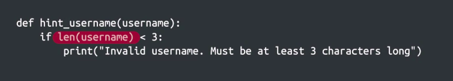

Crash Course on Python
=======================

by Google

# Module 2
#
## Title: Basic Python Syntax

### Expressions and Variables

#### Basic Python Syntax introduction

* Some basic building blocks of Python syntax, things like 
	1. variables
	1. expressions
	1. functions
	1. conditional blocks
* Immerse into Python programming to learn how to formulate statements of code that the computer can understand. This is called __syntax__

#### Data Types

* Text written between quotes in Python is called a __string__
	* In Programming language, a string is known as a data type
* data can come in a lot of different forums, or like we call them data types.
* Data Types
	1. Int
		* which represents whole numbers without a fraction
	1. Float
		* which represents real numbers or in other words, a number with a fractional part like 2.5
* Simple Operations on DataTypes
	```python
	>>> print(7 + 8)
		15
	>>> print('Hello' + ' world')
		Hello world
	>>> # If we mix these two different data types, computer isn't going to know what to do and will raise an error
	>>> print(7 + "8")
		...<SOME ERROR MESSAGE LINES>
		TypeError: unsupported operant type(s) for +: 'int' and 'str'
	>>> # Correct syntax
	>>> print(7 + int(8))
		15
	>>> print(str(7) + "8")
		78
	```
* Read the errors carefully, understand what they're telling you, and then use that new knowledge to help you fix the mistake
* The __type__ function, to have the computer tell you the data type
	```python
	>>> print(type("a"))
		<class 'str'>
	>>> print(type(2))
		<class 'int'>
	>>> print(type(2.5))
		<class 'float'>
	```

##### Summary

* In Python, text in between quotes -- either __single__ or __double quotes__ -- is a __string__ data type
* An __integer__ is a whole number, without a fraction, while a __float__ is a real number that can contain a fractional part
	* For example, 
		1. 1, 7, 342 are all integers
		1. 5.3, 3.14159 and 6.0 are all floats
* When attempting to mix incompatible data types, you may encounter a TypeError
* You can always check the data type of something using the __type()__ function.

#### Variables

* __Variables__ are names that we give to certain values in our programs
	* Those values can be of any data type; numbers, strings or even the results of operations
	* Variables as containers for data
* How it works
	* When you create a variable in your code, your computer reserves a chunk of its own memory to store that value
	* This lets the computer access the variable later to read or modify the value
* Example
	```python
	>>> length = 10
	>>> width = 2
	>>> area = length * width
	>>> print(area)
		20
	```
* The process of storing a value inside a variable is called __assignment__
* An __expression__ is a combination of numbers, symbols or other variables that produce a result when evaluated
* Variables are important in programming because they let you perform operations on data that may change
* For Example
	* Let say we have a script that performs a specific operation on a file
		* We can extend that script to perform the same operation on any file but only if the program used a variable to store the file name
* Variable Naming Restrictions
	1. Don't use keywords or functions that Python reserves for its own, like print
	1. Don't use space
	1. Must start with a letter or an underscore ( _ )
	1. Must be made up of only letters, numbers, and underscores ( _ )
* Examples
	|Variable Name|Valid or Invalid|
	|:---:|:---:|
	|i_am_a_variable|Valid|
	|i_am_a_variable2|Valid|
	|1_is_a_number|Invalid|
	|apples_&_oranges|Invalid|
* Python variables are case sensitive, so capitalization matters
	* Lowercase __name__, uppercase __name__ and all caps __name__ are all valid and are different variable names

#### Expressions, Numbers, and Type Conversions

* **Implicit Conversion**
	* The interpreter automatically converts one data type into another
	* Implicit conversion is where the interpreter helps us out and automatically converts one data type into another, without having to explicitly tell it to do so
* The **plus** ( **+** ) operator can be used to add together strings
	```python
	>>> print('This is test ' + 'string to check "+" sign ' + 'operation with strings')
		This is test string to check "+" sign operation with strings
	```
* **Explicit Conversion**
	* Explicit Conversion is where we manually convert from one data type to another by calling the relevant function for the data type we want to convert to
	* The **str()** function can be used to convert a number into a string
		```python
		>>> total = 2048 + 4357 + 97658 + 125 + 8
		>>> files = 5
		>>> average = total / files
		>>> print("The average size is: " + str(average))
			The average size is: 20839.2
		```

### Functions

#### Defining Functions

* Some built-in functions, we have used
	1. str() - converts a number into a string
	1. type() - tells the type of a certain value
	1. print() - writes text on the screen
	1. len() - returns the length of a string
* Custom function
	* To define a function, 
		1. We use the def keyword
		1. The name of the function is what comes after the keyword
		1. After the name, we have the parameters of the function which are written between parentheses
		1. Followed by a colon at the end of the line
		1. After the colon, we have the body of the function. That's where we state what we want our function to do
		1. The function body is delimited by indentation
		1. The first line that’s no longer indented is the boundary of the function body
	* To call a function, we'll use the word __greeting__
		```python
		>>> def greeting(name):
		>>> 	print('Welcome, ' + name)
		>>>
		>>> greeting('Piyush')
			Welcome, Piyush
		```
	* Function with more than one param
		```python
		>>> def greeting(name, department):
		>>> 	print('Welcome, ' + name)
		>>> 	print('You are a part of ' + department)
		>>>
		>>> greeting('Blake', 'IT Support')
			Welcome, Blake
			You are a part of IT Support
		>>> greeting('Ellis', 'Software engineering')
			Welcome, Ellis
			You are a part of Software engineering
		>>>
		>>> def print_seconds(hours, minutes, seconds):
		>>> 	print(hours*3600 + minutes*60 + seconds) # there are 3600 seconds in an hour and 60 seconds in a minute.
		>>> print_seconds(1,2,3)
			3723
		```

#### Returning Values

* Example Return Statement
	```python
	>>> def area_triangle(base, height):
	>>> 	return (base * height) / 2
	>>> 
	>>> area_a = area_triangle(5, 4)
	>>> area_b = area_triangle(7, 3) 
	>>> sum = area_a + area_b
	>>> print("The sum of both areas is: ", str(sum))
		The sum of both areas is: 20.5
	```
* **Return Statement** allows us to combine calls to functions and to more complex operations which makes your code more reusable
* Return statements can be used to return more than one value
	```python
	>>> def convert_seconds(seconds):
	>>> 	hours = seconds // 3600
	>>> 	minutes = (seconds - hours * 3600) // 60
	>>> 	remaining_seconds = seconds - hours * 3600 - minutes * 60
	>>> 	return hours, minutes, remaining_seconds
	>>> 
	>>> hours, minutes, seconds = convert_seconds(5000)
	>>> print(hours, minutes, seconds)
			1 23 20
	```
* It is possible to return __nothing__
* **None** is a very special data type in Python used to indicate that things are empty or that they return nothing
	```python
	>>> def greeting(name):
	>>> 	print('Welcome, ' + name)
	>>>
	>>> result = greeting('Piyush')
		Welcome, Piyush
	>>> print(result)
		None
	```


#### Code Style

* Having good or bad style when you write code doesn't make much difference between a script succeeding or crashing, but it can make a big difference for the people who use it and contribute to it
* Poor programming style can make life difficult for the IT specialists or system administrators who have to read the script after it's written or make changes to it
* **Goods style** makes life easier for people who have to maintain the code and helps them understand what it does and how it does it
	* It can also reduce errors since it makes updating the code easier and more straightforward
* Some rules for Good Style Code
	1. First off, you want your code to be self-documenting as possible
		* Self-documenting code is written in a way that's readable and doesn't conceal its intent
		* This principle can be applied to all aspects of writing code from picking your variable names to writing clear concise expressions
			```python
			>>> # Good Code Style
			>>> def circle_area(radius):
			>>> 	pi = 3.14
			>>> 	area = pi * (radius ** 2)
			>>> 	print(area)
			>>> 
			>>> circle_area(5)
				78.5
			```
	1. Comments
		* Comments are indicated by the hash character
		* When your computer sees a hash character and understands that it should ignore everything that comes after that character on that line
		* Using comments, lets you explain why a function does something a certain way
			```python 
			>>> def rectangle_area(base, height):
			>>>		area = base*height  # the area is base*height
			>>>		print("The area is " + str(area))
			>>> rectangle_area(5, 6)
			>>>		The area is 30
			```
			<p align="center">
			  <a href="javascript:void(0)" rel="noopener">
			 </a>
			</p>
* Refactoring - The process of re-writing the code to be more self-documenting

### Conditionals

#### Comparing Things

* Boolean : Boolean represents one of two possible states - True or False
* Every time you compare things in Python the result is a Boolean of the appropriate value
* Equality Operator (==)
	* We use this operator to test whether two things are equal to each other
* Python can also compare values. This lets us check whether something is smaller than, equal to, or bigger than something else
	```python
	>>> print(10>1)
		True
	>>> print("cat" == "dog") # the string cat is not equal to the string dog, so the Boolean that's printed is false
		False
	>>> print(1 != 2) # the operator checks that 1 isn't equal to 2
		True
	>>> print( 1 < "1")
		... TypeError ... # This happens because Python doesn't know how to check if a number is smaller than a string.
	>>> print( 1 == "1" )
		False
	```
* In Python uppercase letters are alphabetically sorted before lowercase letters.
	```python
	>>> 'cat' > 'Cat'
		True
	```
* Logical Operators
	1. and
		* To evaluate as true the and operator would need both expressions to be true at the same time
			```python
			>>> print('Yellow' > 'Cyan' and 'Brown' > 'Magenta') 
				False
			>>> # Yellow comes after cyan, but brown doesn't come after magenta. So this means that the first statement is true, but the second one isn't, 
			>>> 	# which makes the result of the whole expression false
			```
	1. or
		* The expression will be true if either of the expressions are true, and false only when both expressions are false
			```python
			>>> print(25 > 50 or 1 != 2)
				True
			```
	1. not
		* the not operator inverts the value of the expression that's in front of it. If the expression is true, it becomes false. If it's false, it becomes true
			```python
			>>> print(not 42 == 'Answer')
				True
			```

#### Branching with if Statements

* **Branching**
	* The ability of a program to alter its execution sequence is called **branching**
	* It's a key component in making your scripts useful
	* For example, 
		1. If it's before noon, you might greet someone by saying good morning instead of good afternoon or good evening
		1. If it's raining outside, you might choose to take an umbrella
		1. If it's cold, you probably wear a jacket
* Sample Function
	<p align="center">
	  <a href="javascript:void(0)" rel="noopener">
	 </a>
	</p>
* The keyword **if** followed by 
	1. the **condition** that we want to check for
	1. then followed by a colon
	1. After that, comes the body of the if block, which is indented further to the right
* The keyword, either __def__ or __if__, indicates the start of a special block
	* At the end of the first line, we use a colon
	* then the body of the function or the if block is indented to the right
* The body of the if block will only execute when the condition evaluates to true; otherwise, it skipped
	```
	>>> def is_positive(number):
	>>>   if number > 0:
	>>>     return True
	>>> 
	>>> is_positive(-5)
		None
	>>> is_positive(0)
		None
	>>> is_positive(13)
		True
	```

#### else Statements

* Sample Function
	<p align="center">
	  <a href="javascript:void(0)" rel="noopener">
	 </a>
	</p>
* The else statement is very useful, but we don't always need it.
	* For Example
		* we want to have a function that checks if a value is even or odd
			```python
			>>> def is_even(number):
			>>> 	if numebr % 2 == 0:
			>>> 		return True
			>>> 	return False
			```
		* The **modulo operator** is represented by the percentage sign and returns the remainder of the integer division between two numbers
		* The **integer division** is an operation between integers that yields two results which are both integers, the **quotient** and the **remainder**
			* if we do an integer division between 5 and 2, the quotient is 2 and the remainder is 1
			* If we do an integer division between 11 and 3, the quotient is 3 and the remainder is 2
		* **Even numbers** are all **multiples of 2** which means the **remainder** of the **integer division** between an **even number and 2** is always going to be **0**
* When a return statement is executed, the function exits, so that the code that follows does not get executed

#### elif Statements

* Sample Function
	* Before implementing elif
		* In this case, we're adding an extra if block inside the else block. This work, but the way the code is nested makes it kind of hard to read
			<p align="center">
			  <a href="javascript:void(0)" rel="noopener">
			 </a>
			</p>
	* After implementing elif
		* To avoid unnecessary nesting and make the code clearer, Python gives us the elif keyword, which lets us handle more than two comparison cases
			<p align="center">
			  <a href="javascript:void(0)" rel="noopener">
			 </a>
			</p>
* The main difference between elif and if statements is we can only write an elif block as a companion to an if block
	* That's because the condition of the elif statement will only be checked if the condition of the if statement wasn't true
* There's no limit to how many conditions we can add, and it's easy to include new ones
	```python
	>>> def number_group(number):
	>>>   if number > 0:
	>>>     return "Positive"
	>>>   elif number == 0:
	>>>     return 'Zero'
	>>>   else:
	>>>     return 'Negative'
	>>> 
	>>> print(number_group(10)) #Should be Positive
		Positive
	>>> print(number_group(0)) #Should be Zero
		Zero
	>>> print(number_group(-5)) #Should be Negative
		Negative
	```

