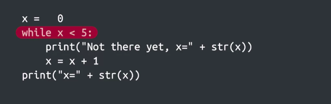
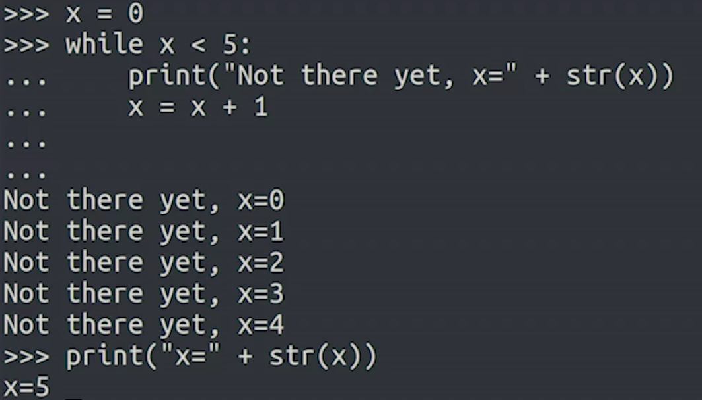
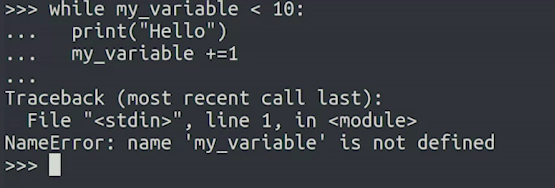
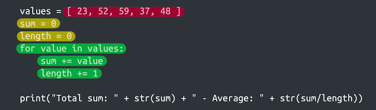
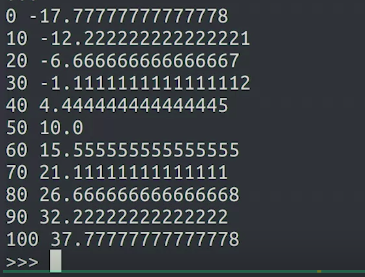
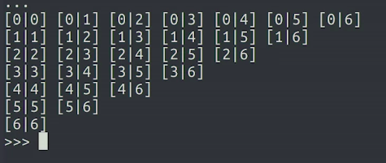
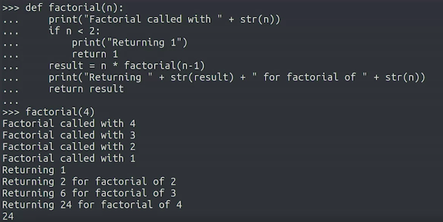

Crash Course on Python
=======================

by Google

# Module 3
#
## Title: Loops

### While Loops

#### Introduction to Loops

* The automated task could be anything like copying files to a bunch of computers on a network, sending personalized emails to a list of users, or verifying that a process is still running
* Techniques for repeating a task are 
	1. While loops
	1. For loops
	1. Recursion

#### What is a while loop?

* **While Loops** instruct your computer to continuously execute your code based on the value of a condition
* This works in a similar way to branching if statements
* The difference here is that the body of the block can be executed multiple times instead of just once
* Example
	<p align="center">
	  <a href="javascript:void(0)" rel="noopener">
	 </a>
	</p>
* **initializing** - To give an initial value to a variable
* After execution
	<p align="center">
	  <a href="javascript:void(0)" rel="noopener">
	 </a>
	</p>

> A **while loop** will continuously execute code depending on the value of a condition. It begins with the keyword while, followed by a comparison to be evaluated, then a colon. On the next line is the code block to be executed, indented to the right. Similar to an if statement, the code in the body will only be executed if the comparison is evaluated to be true. What sets a while loop apart, however, is that this code block will keep executing as long as the evaluation statement is true. Once the statement is no longer true, the loop exits and the next line of code will be executed

#### More while Loop Examples

* Example 1 : **init_x_variable**
	```python
	>>> def attempts(n):
    >>> x = 1
    >>> while x <= n:
    >>>     print("Attempt " + str(x))
    >>>     x += 1
    >>> print("Done")
    >>> 
	>>> attempts(5)
		Attempt 1
		Attempt 2
		Attempt 3
		Attempt 4
		Attempt 5
		Done
	```
* Example 2
	```python
	>>> username = get_username()
	>>> while not valid_username(username):
	>>> 	print('Invalid Username')
	>>> 	username = get_username()
	>>> 
	```
* Example 3
	```python
	>>> def count_down(current):
	>>> 	while (current > 0):
	>>> 		print(current)
	>>> 		current -= 1
	>>> 	print("Zero!")
	>>> 
	>>> count_down(3)
		3
		2
		1
		Zero!
	```
* The important thing to remember is that the condition used by the while loop needs to evaluate to true or false
	* It doesn't matter if this is done by using comparison operators or calling additional functions
	* The conditions used in while loops can also become more complex if we use the logical operators that we encountered when looking into branching, and, or, and not

#### Why Initializing Variables Matters

* One of the most common errors is forgetting to initialize variables with the right value
* When we forget to initialize the variable two different things can happen 
	1. the first possible outcome and the easiest to catch is that Python might raise an error telling us that we're using a variable we haven't defined
		* This error type is a __name error__ and the message that comes after it says we're using an undefined variable
		* Error that we get in this case
			<p align="center">
			  <a href="javascript:void(0)" rel="noopener">
			 </a>
			</p>
		* Fixed code
			```python
			>>> my_variable = 5
			>>> while my_variable < 10:
			>>> 	print("Hello")
			>>> 	my_variable += 1
			>>> 
			```
	1. Second Issue that we might face
		* We might have already used the variable in our program
			* In this case, if we reuse the variable without setting the correct value from the start, it will still have the value from before
			* This can lead to some pretty unexpected behavior
		* Example
			* Code with issue
				* x is still 10 (from the last example that we have seen above **init_x_variable** (example name)), this means that when the while condition gets checked, x is already 10 at the start of the iteration
				* The while condition is false before it even starts and the body never executes
				* So, to resolve this issue, we need to set x back to 1 before starting the second loop
					```python
					>>> product = 1
					>>> while x < 10:
					>>> 	product = product * x
					>>> 	x += 1
					>>> 
					```
			* Fixed Code
				```python
				>>> product = 1
				>>> x = 1
				>>> while x < 10:
				>>> 	product = product * x
				>>> 	x += 1
				>>> 
				```

#### Infinite Loops and How to Break Them

* **Infinite Loop** is a loop that keeps executing and never stops
	* Example
		* In case x = 0, this loop would go on for ever, and we'd get an infinite loop
			```python
			>>> while x % 2 == 0:
			>>> 	x = x / 2
			>>> 
			```
		* To avoid this case, we can make some changes in code like shown below
			* With this approach, the while loop is executed only when x is not zero
				```python
				>>> if x != 0:
				>>> 	while x % 2 == 0:
				>>> 		x = x / 2
				>>>
				>>> # OR - Alternatively we can also write 
				>>>
				>>>	while x != 0 and x % 2 == 0:
				>>> 	x = x / 2
				>>>
				```
* Tool like mentioned below, uses infinte loop in their functionality and they keep executing till interrupt signal is sent to the script indicating to stop
	1. the ping utility on Linux or macOS system
	1. ping-t on a Windows system
* For using infinte loops, one thing to call out is it should always be possible to break the loop by sending a certain signal
	* In the ping example, that signal is the user pressing Ctrl+C
* **break** keyword can be used to signal that the current loop should stop running
	```python
	>>> while True:
	>>> 	do_something()
	>>>		if user_requested_to_stop():
	>>> 		break
	>>>
	```
* How do you avoid the most common pitfalls when writing while loops?
	1. First, remember to initialize your variables
	1. Second, check that your loops won't run forever


### For Loop

#### What is a for loop?

* A **For loop** iterates over a sequence of values
	* Example
		```python
		>>> for x in range(5):
		>>> 	print(x)
		>>>
		```
* There are two important things about this range function
	1. First, in Python and a lot of other programming languages, a range of numbers will start with the value 0 by default
	1. Second, the list of numbers generated will be one less than the given value
		* Example
			```python
			>>> for x in range(5):
			>>> 	print(x)
			>>> 
				0
				1
				2
				3
				4
			```
* Example : Sum of Square
	```python
	>>> def square(n):
	>>>     return n*n
    >>> 
	>>> def sum_squares(x):
	>>>     sum = 0
	>>>     for n in range(x):
	>>>         sum += n ** 2
	>>>     return sum
	>>>     
	>>> print(sum_squares(10))
		285
	```
* Example : For loop with lists
	<p align="center">
	  <a href="javascript:void(0)" rel="noopener">
	 </a>
	</p>
* For loops can be used
	1. to copy files to machines
	1. process the contents of files
	1. automatically install software, etc...
* When you should use **for loops** and when you should use **while loops**
	* Use **for loops** when there's a **sequence of elements** that you want to iterate
	* Use **while loops** when you want to repeat an action **until a condition changes**
	* if whatever you're trying to do can be done with either for or while loops, just use whichever one's your favorite

#### More for Loop Examples

* **Range function** also allows us to specify the first element of the list to generate
	* Example
		```python
		>>> product = 1
		>>> for n in range(1, 10):
		>>> 	product *= n
		>>> 	
		>>> print(product)
			362880
		```
		```python
		>>> def factorial(n):
		>>>     result = 1
		>>>     for i in range(1, n+1):
		>>>         result *= i
		>>>     return result
		>>>     	
		>>> print(factorial(4)) # should return 24
			24
		>>> print(factorial(5)) # should return 120
			120
		```
* Additionally, we can specify a **third parameter** to **change** the **size of each step** (default is 1)
	* This means that instead of going one by one, we could have a larger difference between the elements
	* Example
		```python
		>>> def to_celsius(x):
		>>> 	reutrn (x-32) * 5/9
		>>>
		>>> for x in range(0, 101, 10):
		>>> 	print(x, to_celsius(x))
		>>>
		```
		<p align="center">
		  <a href="javascript:void(0)" rel="noopener">
		 </a>
		</p>

#### Nested For Loops

* Example
	```python
	>>> for left in range(7):
	>>> 	for right in range(left, 7):
	>>> 		print("[" + str(left) + "|" + str(right) + "]", end=' ')
	>>> 	print()
	>>> 	
	```
	<p align="center">
	  <a href="javascript:void(0)" rel="noopener">
	 </a>
	</p>
* If we want **print** to write something else instead of the newline character, we use the end parameter
	* Normally, once **print** has taken the content we passed and written it to the screen, then it writes a special character that creates a new line called the **newline character**
* Example
	```python
	>>> teams = [ 'Dragons', 'Wolves', 'Pandas', 'Unicorns']
	>>> for home_team in teams:
    >>> 	for away_team in teams:
    >>> 		if home_team != away_team:
    >>> 			print(home_team + " vs " + away_team)
    >>> 
    ```
* The longer the list code needs to iterate through, the longer it takes computer to complete the task

> __For Loops__ are best when you want to iterate over a known sequence of elements but when you want to operate while a certain condition is true, __While Loops__ are the best choice

* The **Continue keyword** is used to skip the current iteration and continue with the next one
	* This is typically used to jump ahead when some of the elements of the sequence aren’t relevant

### Recursion

* __Recursion__ is the repeated application of the same procedure to a smaller problem
* __Recursion__ let's us tackle complex problems by reducing the problem to a simpler one
* In programming, recursion is a way of doing a repetitive task by having a function call itself
	* A recursive function calls itself usually with a modified parameter until it reaches a specific condition. This condition is called the **base case**
* Example
	```python
	>>> def factorial(n):
	>>>		if n < 2: # This is the base case
	>>>			return 1
	>>>		return n * factorial(n-1)
	>>>		
	```
* Example
	* We can see the function kept calling itself until it reached the base case
	* After that, each function returned the value of the previous function multiplied by __n__ until the original function returned
		<p align="center">
		  <a href="javascript:void(0)" rel="noopener">
		 </a>
		</p>
* In Python by default, you can call a recursive function 1,000 times until you reach the limit

#### Recursion in Action in the IT Context

`NOTHING WORTH WRITING`