Crash Course on Python
=======================

by Google

# Module 4
#
## Title: Strings, Lists and Dictionaries

### Strings

#### What is a string?

* A string is a data type in Python that's used to represent a piece of text
* It's written between quotes, either double quotes or single quotes
	```python
	>>> print('Sample String')
		Sample String
	>>> print("Sample String")
		Sample String
	```
* It doesn't matter which type of quotes you use as long as they match
* If we mix up double and single quotes, Python won't be too happy, and it'll return a syntax error, telling us it couldn't find the end of the string
* A string can be as short as zero characters, usually called an empty string or really long
	```python
	>>> test_str1 = ''
	>>> test_str2 = 'loooooooooooooooooooooooooooooooooooooooooooooooooooong cat'
	```
* We can use strings to build longer strings using the __plus sign__ and action called __concatenating__
	```python
	>>> name = 'Piyush'
	>>> print('Welcome, ', name)
		Welcome, Piyush
	```
* A less common operation is to multiply the string by a number, which multiplies the content of the string that many times
	```python
	>>> txt = 'example'
	>>> print(txt * 3)
		exampleexampleexample
	```
* The **len** function tells us the number of characters contained in the string
	```python
	>>> test_str2 = 'loooooooooooooooooooooooooooooooooooooooooooooooooooong cat'
	>>> print(len(test_str2))
		59
	```
* Example
	```python
	>>> def double_word(word):
	>>>     new_word = word * 2
	>>>     return new_word + str(len(new_word))
	>>>     
	>>> print(double_word("hello")) # Should return hellohello10
		hellohello10
	>>> print(double_word("abc"))   # Should return abcabc6
		abcabc6
	>>> print(double_word(""))      # Should return 0
		0
	```
* **The contents of a text file are also strings**
* There are tons of things we could do with strings in our scripts
	1. we can check if files are named a certain way by looking at the filename and seeing if they match our criteria
	1. we can create a list of emails by checking out the users of our system and concatenating our domain
	1. script that worked with a bunch of files and took different actions according to the name of each file
		* So the file ended in a certain extension say, .TXT , then script would print it
		* If the file had a certain string and the name, say, test, then script would ignore it and move on to the next thing

#### The Parts of a String

* **String Indexing**
	* This operation lets us access the character in a given position or index using square brackets and the number of the position we want
		```python
		>>> name = 'Jaylen'
		>>> print(name[1])
			a
		```
* `Python starts counting indexes from 0`
* **Last Index** of a string will always be **one less than the length of that string**
	```python
	>>> name = 'Jaylen'
	>>> print(name[len(name)-1])
		n
	```
* **Negative Indexes** lets us access the positions in the string starting from the last
	```python
	>>> text = 'this is test string'
	>>> print(text[-1])
		g
	>>> print(text[-2])
		n
	```
* A slice is the portion of a string that can contain more than one character, also sometimes called a **substring**
	```python
	>>> color = 'Orange'
	>>> color[1:4] # 4 is excluded from the result
		ran
	```
* Another option for the range is to include only one of the two indexes. In that case, it's assumed that the other index is either 0 for the first value or the length of the string for the second value
	```python
	>>> color = 'Orange'
	>>> color[:4] # Accessing the slice from nothing to 4 takes the first four characters of the string, indexes 0 to 3
		Oran
	>>> color[1:]
		range
	>>> color[4:] # Accessing the slice from 4 to nothing takes everything from index four onward
		ge
	```


#### Creating New Strings

* Strings are **immutable** in python, i.e. they cannot be modified
* To modify a string, we will have to create a new one with correction
	* Example
		<p align="center">
		  <a href="javascript:void(0)" rel="noopener">
		 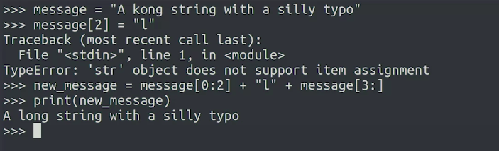</a>
		</p>
* We can assign a new value to the same variable
	<p align="center">
	  <a href="javascript:void(0)" rel="noopener">
	 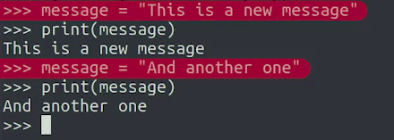</a>
	</p>
* A **method** is a function associated with a specific class
	* **index()** method returns the index of the given substring, inside the string
		* The substring that we pass, can be as long or as short as we want
		* the index method returns just the first position that matches
		* if the substring isn't there, we would get an error
			```python
			>>> pets = 'Cats & Dogs'
			>>> print(pets.index('&'))
				5
			>>> pets.index('C')
				0
			>>> pets.index('Dog')
				0
			>>> pets.index('s')
				3
			>>> pets.index('x')
				..<ERROR MESSAGE>.. ValueError: substring not found
			>>> 
			```
* We can use the keyboard **in** to check if a substring is contained in a string
	* It'll return true if the substring is part of the string, and false if it's not
	```python
	>>> pets = 'Cats & Dogs'
	>>> 'Dragons' in pets
		False
	>>> "Cats" in pets
		True
	```
* Example
	1. Write a program that replaces this old domain with the new one in any outdated email addresses. The function to replace the domain would look like
		* First, we define the replace_domain function which accepts three parameters
			* The email address to be checked, the old domain, and the new domain
			* Having all these values as parameters instead of directly in the code, makes our function reusable
		* In the first line of the body of the function, we check if the concatenation of the @ sign and the old domain are contained in the email address, using the keyword __in__
			* We check this to make sure the email has old domain on the portion that comes after the @ sign
			* If the condition is true, the email address needs to be updated
				* To do that, we first find out the index were the old domain, including the @ sign starts. We know that this index will be a valid number because we've already checked that the substring was present
				* So, using this index, we create the new email. This is a string that contains the first portion of the old email, up until the index we had calculated, followed by the @ sign and the new domain. Finally, we return this new email. If the email didn't contain the new domain, then we can just return it, which is what we do in the last line
					<p align="center">
					  <a href="javascript:void(0)" rel="noopener">
					 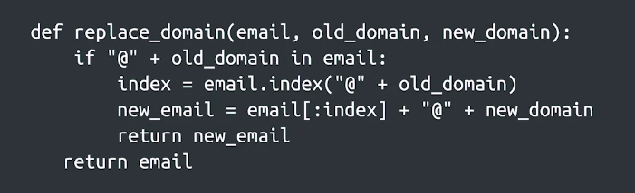</a>
					</p>

#### More String Methods

* String methods
	1. upper()
		```python
		>>> print('this is test'.upper())
			THIS IS TEST
		```
	1. lower()
		```python
		>>> print('THIS IS TEST'.lower())
			this is test
		```
	1. strip()
		* This method get rid of surrounding spaces in the string
		* strip doesn't just remove spaces, it also removes tabs and new line characters, which are all characters we don't usually want in user-provided strings
			```python
			>>> print(' yes '.strip())
				'yes'
			```
	1. lstrip()
		* to get rid of the whitespace characters just to the left or to the right of the string instead of both sides
	1. rstrip()
		* to get rid of the whitespace characters just to the left or to the right of the string instead of both sides
	1. endswith() - returns whether the string ends with a certain substring
		```python
		>>> 'Forest'.endswith('rest')
			True
		```
	1. count() - returns how many times a given substring appears within a string
		```python
		>>> print('this is test string'.count('t'))
			4
		```
	1. isnumeric()
		* The method isnumeric returns whether the string's made up of just numbers
			```python
			>>> 'Forest'.isnumeric()
				False
			>>> '12312'.isnumeric()
				True
			```
		* if we have a string that is numeric, we can use the int function to convert it to an actual number
			```python
			>>> '12312'.isnumeric()
				True
			>>> int('12312') + int(52324)
				64636
			```
	1. join()
		* The join method can also be used for concatenating
		* The method receives a list of strings and returns one string with each of the strings joined by the initial string
			```python
			>>> ' '.join(['this', 'is', 'a', 'phrase', 'joined', 'by', 'spaces'])
				this is a phrase joined by spaces
			```
	1. split()
		* The split method returns a list of all the words in the initial string and it automatically splits by any whitespace
		* It can optionally take a parameter and split the strings by another character, like a comma or a dot
			```python
			>>> 'this is string'.split()
				['this', 'is', 'string']
			>>> 'split,on,comma'.split(',')
				['split', 'on', 'comma']
			```
* Example
	```python
	>>> def initials(phrase):
	>>>     words = phrase.split()
	>>>     result = ""
	>>>     for word in words:
	>>>         result += word[0].upper()
	>>>     return result
	>>>     	
	>>> print(initials("Universal Serial Bus")) # Should be: USB
		USA
	>>> print(initials("local area network")) # Should be: LAN
		LAN
	>>> print(initials("Operating system")) # Should be: OS
		OS
	```

#### Formatting Strings

* **format method**
	1. We generate a string that has those variables in it by using the curly brackets placeholder to show where the variables should be written
	1. We then pass the variables as a parameter to the format method
	1. It doesn't matter that name is a string and number is an integer, The format method deals with that, so we don't have to
	* Example
		```python
		>>> name = 'Piyush'
		>>> number = len(name) * 3
		>>> print('Hello {}, your lucky number is {}'.format(name, number))
			Hello Piyush, your lucky number is 18
		```
	* One of the things we can put inside the curly brackets is the name of the variable we want in that position to make the whole string more readable
		* As we're using placeholders with variable names, the order in which the variables are passed to the format function doesn't matter
		* But for this to work, we need to set the names we're going to use and assign a value to them inside the parameters to format
			```python
			>>> name = 'Piyush'
			>>> # number = len(name) * 3
			>>> print('Your lucky number is {number}, {name}'.format(name=name, number=len(name)*3))
				Your lucky number is 18, Piyush
			```
* Formatting Expression
	* Example
		<p align="center">
		  <a href="javascript:void(0)" rel="noopener">
		 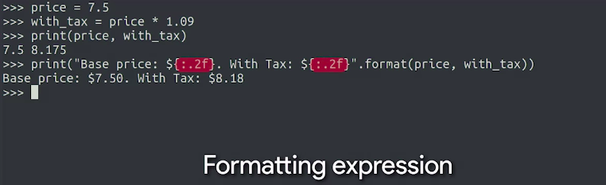</a>
		</p>
	* These expressions are needed when we want to tell Python to format our values in a way that's different from the default
	* The expression starts with a colon to separate it from the field name that we saw before
	* After the colon, we write .2f. This means we're going to format a float number and that there should be two digits after the decimal dot
		```python
		>>> price = 7.5
		>>> with_tax = price * 1.09
		>>> print(price, with_tax)
			7.5 8.175
		>>> print("Base price: ${:.2f}. With Tax: ${:.2f}".format(price, with_tax))
			Base price: $7.50. With Tax: $8.18
		```
	* Example
		* In the first expression we're saying we want the numbers to be aligned to the right for a total of three spaces
		* In the second expression we're saying we want the number to always have exactly two decimal places and we want to align it to the right at six spaces
		* We can use string formatting like this to make the output of our program look nice and also to generate useful logging and debugging messages
			<p align="center">
			  <a href="javascript:void(0)" rel="noopener">
			 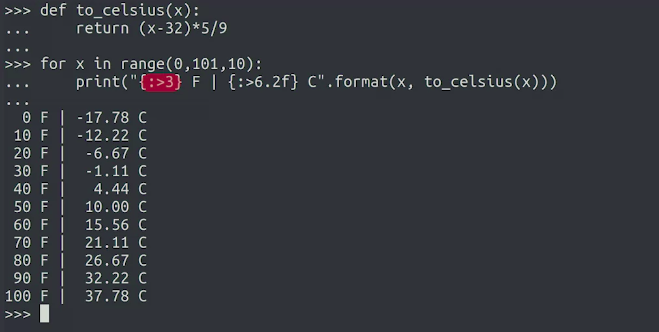</a>
			</p>
* A formatted string literal or f-string is a string that starts with 'f' or 'F' before the quotes. These strings might contain {} placeholders using expressions like the ones used for format method strings
* The important difference with the format method is that it takes the value of the variables from the current context, instead of taking the values from parameters
	```python
	>>> name = "Micah"
	>>> print(f'Hello {name}')
		Hello Micah
	```
	```python
	>>> item = "Purple Cup"
	>>> amount = 5
	>>> price = amount * 3.25
	>>> print(f'Item: {item} - Amount: {amount} - Price: {price:.2f}')
		Item: Purple Cup - Amount: 5 - Price: 16.25
	```

### Lists

#### What is a list?

* **lists** can be think of as long boxes with the space inside the box divided up into different slots. Each slot can contain a different value
		<p align="center">
		  <a href="javascript:void(0)" rel="noopener">
		 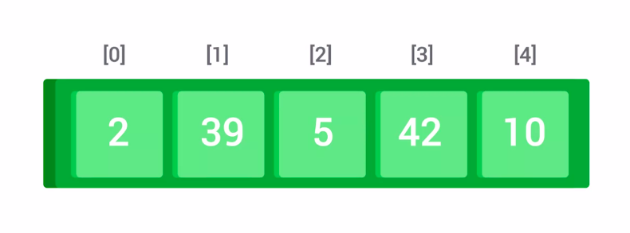</a>
		</p>
* In Python, we use square brackets to indicate where the **list** starts and ends
	```python
	>>> x = ['this', 'is', 'sample', 'list']
	>>> type(x)
		<class 'list'>
	>>> print(x)
		['this', 'is', 'sample', 'list']
	>>> len(x)
		4
	```
* The length of the list is how many elements it has. To get that value, we'll use the same **len** function
	```python
	>>> x = ['this', 'is', 'sample', 'list']
	>>> len(x)
		4
	```
* To check if a list contains a certain element, we can use the keyword "in"
	```python
	>>> x = ['this', 'is', 'sample', 'list']
	>>> 'this' in x
		True
	>>> 'apple' in x
		False
	```
* **Indexing** is used to access individual elements depending on their position in the list
	```python
	>>> x = ['this', 'is', 'sample', 'list']
	>>> x[0]
		this
	>>> x[len(x)-1]
		list
	```
* Slicing
	* For this, we use ranges of two numbers separated by a colon. Again, the second element isn't included in the slice
		```python
		>>> x = ['this', 'is', 'sample', 'list']
		>>> x[1:3]
			['is', 'sample']
		>>> x[:2]
			['this', 'is']
		>>> x[2:]
			['sample', 'list']
		```
* Example
	```python
	>>> def get_word(sentence, n):
	>>> 	# Only proceed if n is positive 
	>>> 	if n > 0:
	>>> 		words = sentence.split()
	>>> 		# print(words)
	>>> 		# Only proceed if n is not more than the number of words 
	>>> 		if n <= len(words):
	>>> 			return(words[n-1])
	>>> 	return("")
	>>> 		
	>>> print(get_word("This is a lesson about lists", 4)) # Should print: lesson
		'lession'
	>>> print(get_word("This is a lesson about lists", -4)) # nothing
		''
	>>> print(get_word("Now we are cooking!", 1)) # Should print: Now
		'Now'
	>>> print(get_word("Now we are cooking!", 5)) # Nothing
		''
	```
* In Python, strings and lists are both examples of sequences
	* They share a bunch of operations like 
		1. __iterating__ over them using __for-loops__
		1. __indexing__ using the __len__ function to know the length of the sequence
		1. using __plus__ to __concatenate__ two sequences
		1. using __in__ to verify if the sequence __contains__ an element

#### Modifying the Contents of a List

* One of the ways that lists and strings are different is that __lists__ are __mutable__
	* This means we can add, remove, or modify elements in a list
* Methods that let us modify the list
	1. __append__ Method
		* The append method adds a new element at the end of the list
			* It doesn't matter how long the list is. The element always gets added to the end
			* You could start with an empty list and add all of its items using append
	1. __insert__ Method
		* insert method is used to insert an element in a different position, instead of at the end
		* The insert method takes an index as the first parameter and an element as the second parameter.
			* It adds the element at that index in the list
		* To add it as the first element, we use index zero and we can use any other number
		* If we use an index higher than the current length, the element just gets added to the end
	1. __remove__ Method
		* The remove method removes from the list the first occurrence of the element we pass to it
		* It throws an error if in case element is not present in the list
	1. __pop__ Method
		* The pop method returns the element that was removed at the index that was passed
	1. Last way to modify the contents of a list is to change an item by assigning something else to that position
* Code Sample for all the methods mentioned above:
	<p align="center">
	  <a href="javascript:void(0)" rel="noopener">
	 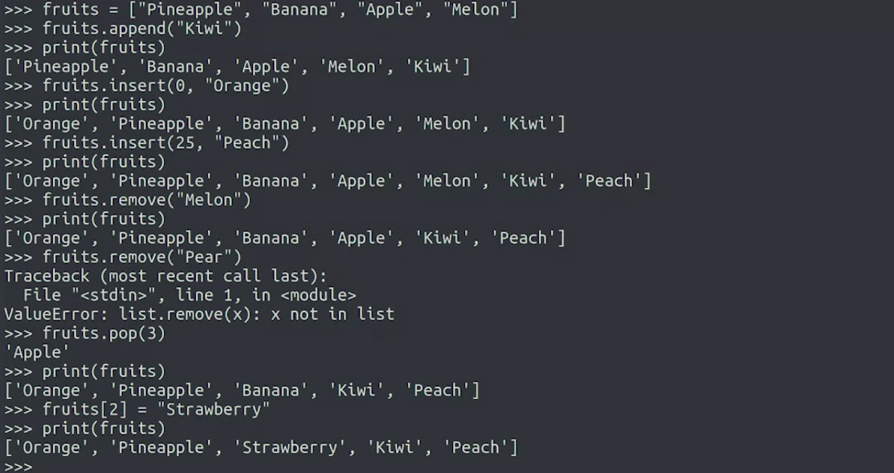</a>
	</p>
* Example
	```python
	>>> def skip_elements(elements):
	>>> 	# Initialize variables
	>>> 	new_list = []
	>>> 	i = 0
	>>> 
	>>> 	# Iterate through the list
	>>> 	for element in elements:
	>>> 		# Does this element belong in the resulting list?
	>>> 		if i % 2 == 0:
	>>> 			# Add this element to the resulting list
	>>> 			new_list.append(element)
	>>> 		# Increment i
	>>> 		i += 1
	>>> 
	>>> 	return new_list
	>>> 
	>>> print(skip_elements(["a", "b", "c", "d", "e", "f", "g"])) # Should be ['a', 'c', 'e', 'g']
		['a', 'c', 'e', 'g']
	>>> print(skip_elements(['Orange', 'Pineapple', 'Strawberry', 'Kiwi', 'Peach'])) # Should be ['Orange', 'Strawberry', 'Peach']
		['Orange', 'Strawberry', 'Peach']
	>>> print(skip_elements([])) # Should be []
		[]
	```

#### Lists and Tuples

* Strings are sequences of characters and are immutable
* Lists are sequences of elements of any type and are mutable
* **Tuples** are sequences of elements of any type that are immutable
	* We write tuples in parentheses instead of square brackets.
		```python
		>>> tuple_example = ('this', 'is', 'sample', 'tuple')
		```
* There are cases when we want to make sure an element in a certain position or index refers to one specific thing and won't change
* When using tuples the **position of the elements inside the tuple have meaning**
* When a function returns more than one value, it's actually returning a tuple
* This function returns three values. In other words, it returns a tuple of three elements
	* since this is a tuple, the order matters
	* The first element represents the hours, the second one represents the minutes, and the third represents the seconds
	* One interesting thing we can do with tuples is unpack them. This means that we can turn a tuple of three elements into three separate variables
		```python
		>>> def convert_seconds(seconds):
		>>> 	hours = seconds // 3600
		>>> 	minutes = (seconds - hours * 3600) // 60
		>>> 	remaining_seconds = seconds - hours * 3600 - minutes * 60
		>>> 	return hours, minutes, remaining_seconds
		>>> 
		>>> result = convert_seconds(5000)
		>>> type(result)
			<class 'tuple'>
		>>> print(result)
			(1, 23, 20)
		>>> hours, minutes, seconds = result # unpacking tuples
		>>> print(hours, minutes, seconds)
			1 23 20
		>>> hours, minutes, seconds = convert_seconds(5000) # unpacking tuples
		>>> print(hours, minutes, seconds)
			1 23 20
		```
* In Python, it's really common to use tuples to represent data that has more than one value and that needs to be kept together
* Example
	```python
	>>> def file_size(file_info):
	>>> 	name, extension, size= file_info
	>>> 	return("{:.2f}".format(size / 1024))
	>>> 
	>>> print(file_size(('Class Assignment', 'docx', 17875))) # Should print 17.46
		17.46
	>>> print(file_size(('Notes', 'txt', 496))) # Should print 0.48
		0.48
	>>> print(file_size(('Program', 'py', 1239))) # Should print 1.21
		1.21
	```

#### Iterating over Lists and Tuples

* Example Iteration Over List
	<p align="center">
	  <a href="javascript:void(0)" rel="noopener">
	 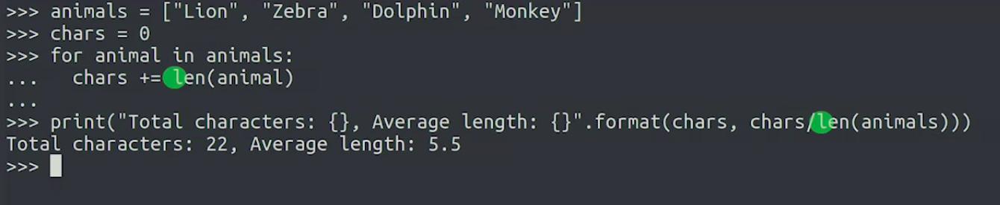</a>
	</p>
* The **enumerate** function returns a tuple for each element in the list
	1. The first value in the tuple is the index of the element in the sequence
	1. The second value in the tuple is the element in the sequence
		```python
		>>> winners = ['Ashley', 'Dylan', 'Reese']
		>>> 
		>>> for index, person in enumerate(winners):
		>>> 	print('{} - {}'.format(index + 1, person))
		>>> 
			1 - Ashley
			2 - Dylan
			3 - Reese
		```
* Example (lil complex)
	* Write a function that creates a new list containing one string per person including their name and the email address between angled brackets
	* Sample output data: `Terrance Ford <terrance@example.com>`
		<p align="center">
		  <a href="javascript:void(0)" rel="noopener">
		 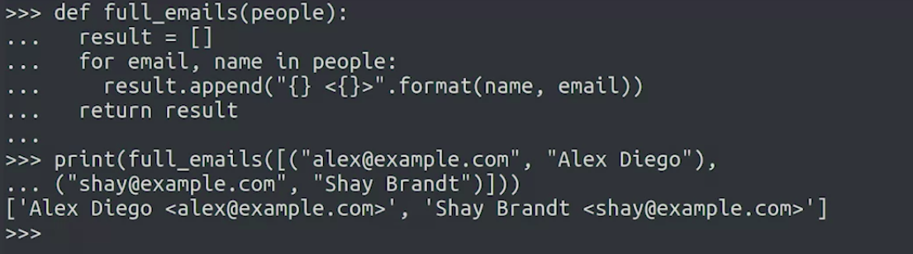</a>
		</p>


#### List Comprehensions

* Example
	1. Regular way
	```python
	>>> multiples = []
	>>> for x in range(1, 11):
	>>> 	multiples.append(x*7)
	>>>
	>>> print(multiples)	
		[7, 14, 21, 28, 35, 42, 49, 56, 63, 70]
	```
	1. Using List Comprehension
	```python
	>>> multiples = [ x * 7 for x in range(1, 11) ]
	>>> print(multiples)
		[7, 14, 21, 28, 35, 42, 49, 56, 63, 70]
	```
* __List comprehensions__ let us create new lists based on sequences or ranges
	* we can use this technique whenever we want to create a list based on a range
	* or based on the contents of a list a tuple a string or any other Python sequence
* Example
	1. Code to get the length of each element in a list
		```python
		>>> languages = ['Python', 'Ruby', 'Perl', 'Go', 'Java', 'C']
		>>> lengths = [ len(language) for language in languages ]
		>>> print(lengths)
			[6, 4, 4, 2, 4, 1]]
		```
	1. We want all the numbers that are divisible by 3 between 0 and a 100
		```python
		>>> z = [ x for x in range(101) if x % 3 == 0 ]
			[0, 3, 6, 9, 12, 15, 18, 21, 24, 27, 30, 33, 36, 39, 42, 45, 48, 51, 54, 57, 60, 63, 66, 69, 72, 75, 78, 81, 84, 87, 90, 93, 96, 99]
		```
	1. Program to print odd numbers
		```python
		>>> def odd_numbers(n):
		>>> 	return [x for x in range(n+1) if x % 2 != 0]
		>>> 		
		>>> print(odd_numbers(5))  # Should print [1, 3, 5]
			[1, 3, 5]
		>>> print(odd_numbers(10)) # Should print [1, 3, 5, 7, 9]
			[1, 3, 5, 7, 9]
		>>> print(odd_numbers(11)) # Should print [1, 3, 5, 7, 9, 11]
			[1, 3, 5, 7, 9, 11]
		>>> print(odd_numbers(1))  # Should print [1]
			[1]
		>>> print(odd_numbers(-1)) # Should print []
			[]
		```

### Dictionaries

#### What is a dictionary?

* Like lists, dictionaries are used to organize elements into collections
	* Unlike lists, you don't access elements inside dictionaries using their position.
	* Instead, the data inside dictionaries take the form of pairs of keys and values
		* To get a dictionary value we use its corresponding key
* In a dictionary you can use a bunch of different data types as keys, like strings, integers, floats, tuples, and more
* Dictionaries use curly brackets to define their content
* Example
	```python
	>>> x = {}
	>>> type(x)
		<class 'dict'>
	>>>
	```
	```python
	>>> file_counts = {'jpg': 10, 'txt': 14, 'csv': 2, 'py': 23} # Number of files corresponding to each extension
	>>> print(file_counts)
		{'jpg': 10, 'txt': 14, 'csv': 2, 'py': 23}
	>>> file_counts['txt'] # to get how many files are there with txt extension
		14
	>>> # to Check if key is present in dictionary
	>>> 'jpg' in file_counts
		True
	>>> 'html' in file_counts
		False
	```
* Dictionaries are __mutable__, it means we can add remove and replace entries
	```python
	>>> file_counts = {'jpg': 10, 'txt': 14, 'csv': 2, 'py': 23} # Number of files corresponding to each extension
	>>> print(file_counts)
		{'jpg': 10, 'txt': 14, 'csv': 2, 'py': 23}
	>>> file_counts['cfg'] = 8
	>>> print(file_counts)
		{'jpg': 10, 'txt': 14, 'csv': 2, 'py': 23, 'cfg': 8}
	>>>
	>>> # When you use a key that already exists to set a value, the value that was already paired with that key is replaced
	>>> file_counts['csv'] = 17
	>>> print(file_counts)
		{'jpg': 10, 'txt': 14, 'csv': 17, 'py': 23, 'cfg': 8}
	```
* When you use a key that already exists to set a value, the value that was already paired with that key is replaced
	* If we try to store two different values for the same key, we'll just replace one with the other
* We can delete elements from a dictionary with the **del** keyword by passing the dictionary and the key to the element as if we were trying to access it
	```python
	>>> file_counts = {'jpg': 10, 'txt': 14, 'csv': 2, 'py': 23} # Number of files corresponding to each extension
	>>> print(file_counts)
		{'jpg': 10, 'txt': 14, 'csv': 2, 'py': 23}
	>>> del file_counts['csv']
	>>> print(file_counts)
		{'jpg': 10, 'txt': 14, 'py': 23}
	```

#### Iterating over the Contents of a Dictionary

* If you use a dictionary in a for loop, the iteration variable will go through the keys in the dictionary
* Example	
	```python
	>>> file_counts = {'jpg': 10, 'txt': 14, 'csv': 2, 'py': 23} # Number of files corresponding to each extension
	>>> print(file_counts)
		{'jpg': 10, 'txt': 14, 'csv': 2, 'py': 23}
	>>> 
	>>> for extension in file_counts:
	>>> 	print(extension)
	>>>
		jpg
		txt
		csv
		py
	```
* If you want to **access** the associated **values**, you can either **use** the **keys** as **indexes** of the **dictionary** or you can use the **items method** which **returns a tuple** for **each element** in the dictionary
* Example	
	```python
	>>> file_counts = {'jpg': 10, 'txt': 14, 'csv': 2, 'py': 23} # Number of files corresponding to each extension
	>>> print(file_counts)
		{'jpg': 10, 'txt': 14, 'csv': 2, 'py': 23}
	>>> 
	>>> for ext, amount in file_counts.items():
	>>> 	print('There are {} files with the .{} extension'.format(amount, ext))
	>>>
		There are 10 files with the .jpg extension
		There are 14 files with the .txt extension
		There are 2 files with the .csv extension
		There are 23 files with the .py extension
	```
* Methods to access keys and values are
	1. dict.keys()
	1. dict.values()
		```python
		>>> file_counts = {'jpg': 10, 'txt': 14, 'csv': 2, 'py': 23} # Number of files corresponding to each extension
		>>> print(file_counts)
			{'jpg': 10, 'txt': 14, 'csv': 2, 'py': 23}
		>>>
		>>> file_counts.keys()
			dict_keys(['jpg', 'txt', 'csv', 'py'])
		>>> file_counts.values()
			dict_values([10, 14, 2, 23])
		>>> for value in file_counts.values():
		>>> 	print(value)
		>>>
			10
			14
			2
			23
		```
* Each key can be present only once, dictionaries are a great tool for counting elements and analyzing frequency
* Script for counting how many times each letter appears in a piece of text
	* we're first initializing an empty dictionary, then going through each letter in the given string
	* For each letter, we check if it's not already in the dictionary. And in that case, we initialize an entry in the dictionary with a value of zero
	* Finally, we increment the count for that letter in the dictionary
	* To sum up, we've created a dictionary where the keys are each of the letters present in the string and the values are how many times each letter is present
		<p align="center">
		  <a href="javascript:void(0)" rel="noopener">
		 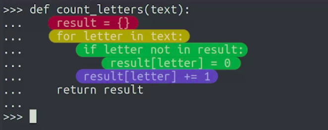</a>
		</p>
		<p align="center">
		  <a href="javascript:void(0)" rel="noopener">
		 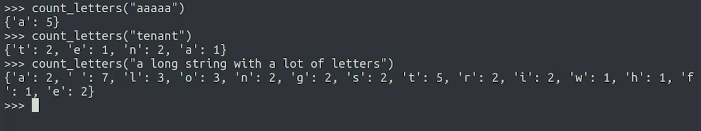</a>
		</p>

#### Dictionaries vs. Lists

* Use dictionaries when you plan on searching for a specific element
* In lists, you can store any data type
* In dictionaries, we can store any data type for the values but the keys are restricted to specific types
	* As a rule of thumb, you can use any immutable data type; numbers, booleans, strings and tuples as dictionary keys
	* But you can't use lists or dictionaries for that
* Example
	```python
	>>> wardrobe = {"shirt":["red","blue","white"], "jeans":["blue","black"]}
	>>> for k, colors in wardrobe.items():
	>>> 	for color in colors:
	>>> 		print("{} {}".format(color, k))
	>>>
		red shirt
		blue shirt
		white shirt
		blue jeans
		black jeans
	```
* **Set**
	* A set is used when you want to store a bunch of elements and be certain that there are only present once
	* Elements of a set must also be immutable
	* You can think of this as the keys of a dictionary with no associated values or you could see it as a list where what matters isn't the order of the elements but whether an element is in the list or not

