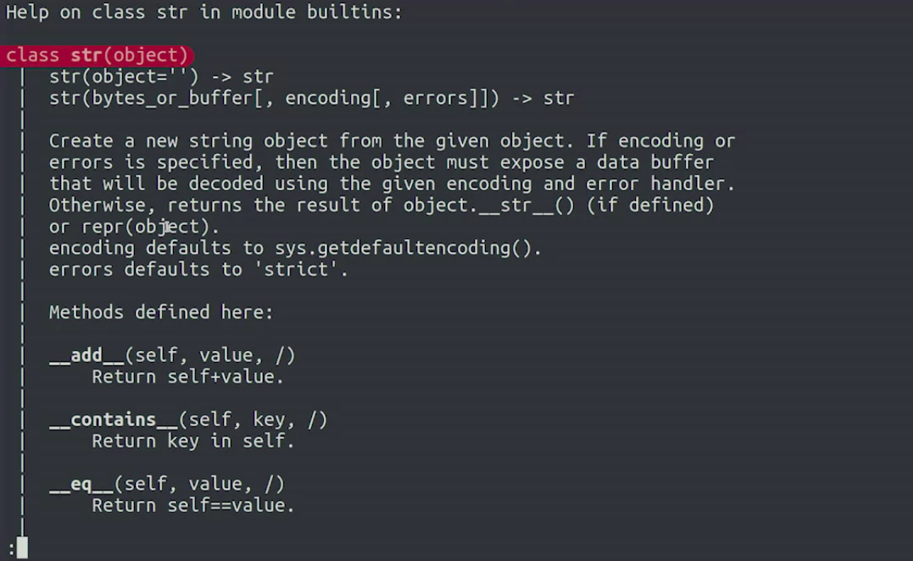
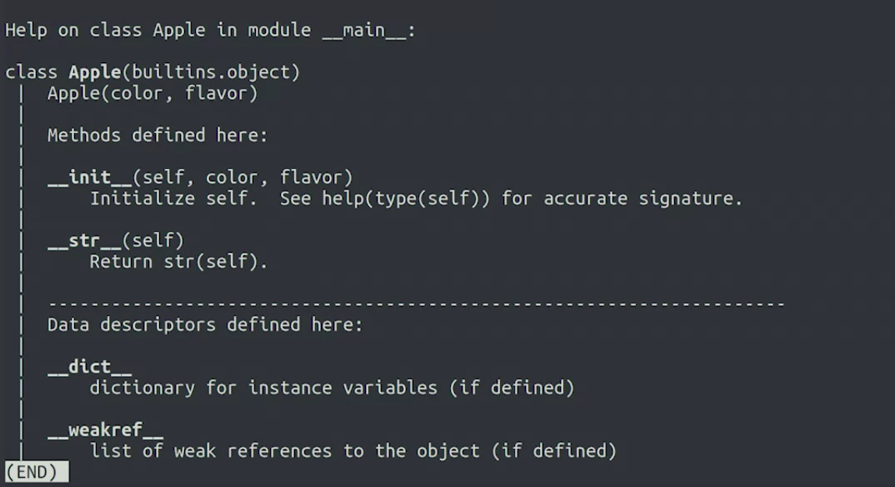
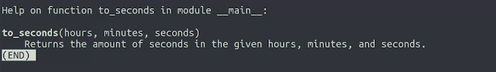

Crash Course on Python
=======================

by Google

# Module 5
#
## Title: Object Oriented Programming

### Object-Oriented Programming

> **Object-Oriented Programming** is a way of thinking about and implementing our code

#### What is Object-Oriented Programming?

* Python uses a programming pattern called **object-oriented programming**, which models concepts using **classes** and **objects**
* **Object-Oriented Programming** - This is a flexible, powerful paradigm where classes represent and define concepts, while objects are instances of classes
* We can have a class called apple that defines the characteristics of an apple
	* We could then have a bunch of instances of that apple class, which are the individual objects of that class
	* In this example, the attributes of apple are the color and flavor
* Almost everything in Python is an object, all of the numbers, strings, lists, and dictionaries
* The **attributes** are the characteristics associated to a type, and the **methods** are the functions associated to a type

#### Classes and Objects in Python

* When we use the type function, Python tells us which class the value or variable belongs to
	```python
	>>> type(0)
		<class 'int'>
	>>> type("")
		<class 'str'>
	```
* **dir** function - This gets the Interpreter to print to the screen a list of all the attributes and methods.
	* The first bunch here are special methods that begin and end with double underscores
		* they're called by some of the internal Python functions
		* For example, 
			* the `__len__` method is called by the len function that we've used before to find out the length of a string
			* the `__ge__` method is used to compare if one string is greater than or equal to another, when using the greater than or equal to operator
				```python
				>>> dir("")
					['__add__', '__class__', '__contains__', '__delattr__', '__dir__', '__doc__', '__eq__', '__format__', '__ge__', '__getattribute__', '__getitem__', '__getnewargs__', '__gt__', '__hash__', '__init__', '__init_subclass__', '__iter__', '__le__', '__len__', '__lt__', '__mod__', '__mul__', '__ne__', '__new__', '__reduce__', '__reduce_ex__', '__repr__', '__rmod__', '__rmul__', '__setattr__', '__sizeof__', '__str__', '__subclasshook__', 'capitalize', 'casefold', 'center', 'count', 'encode', 'endswith', 'expandtabs', 'find', 'format', 'format_map', 'index', 'isalnum', 'isalpha', 'isascii', 'isdecimal', 'isdigit', 'isidentifier', 'islower', 'isnumeric', 'isprintable', 'isspace', 'istitle', 'isupper', 'join', 'ljust', 'lower', 'lstrip', 'maketrans', 'partition', 'replace', 'rfind', 'rindex', 'rjust', 'rpartition', 'rsplit', 'rstrip', 'split', 'splitlines', 'startswith', 'strip', 'swapcase', 'title', 'translate', 'upper', 'zfill']
				```
* **help** function - When we use the help function on any variable or value, we're showing all the documentation for the corresponding class
	* We can see the documentation for a bunch of methods, and it tells us the parameters that method receives and the type of return value
		* It also includes an explanation of what the method does
			```python
			>>> help("") # To see help for str class
				...<DOC SHOWN IN IMAGE>...
			```
			<p align="center">
			  <a href="javascript:void(0)" rel="noopener">
			 </a>
			</p>
		* When you're done looking at documentationl, you can just type **q** to **quit**

#### Defining New Classes

* Example
	```python
	>>> class Apple:
	>>> 	pass
	```
* How to define a class
	* In Python, we use the **class** reserved keyword to tell the computer that we're starting a new class
	* We follow this with the **name** of the **class** and **a colon**
	* The Python style guidelines recommend that **class names** should start with a **capital letter**
	* Class definitions follow the same pattern of other blocks like functions, loops or conditional branches
	* After the line with the class definition comes the body of the class, which is **indented to the right**
		* we use the **pass** keyword, to show that the **body is empty**. We can also use the same keyword as a placeholder in any empty Python block
* Example
	* Color and Flavor are 2 str type attributes of class Apple
	* To create a new instance of any class, we call the name of the class as if it were a function
		```python
		>>> class Apple:
		>>> 	color = ""
		>>> 	flavor = ""
		>>> 		
		>>> jonagold = Apple()
		>>> jonagold.color = 'red'
		>>> jonagold.flavor = 'sweet'
		>>> 
		>>> print(jonagold.color)
			red
		>>> print(jonagold.flavor)
			sweet
		>>> print(jonagold.color.upper()) # The attributes and methods of some objects can be other objects and can have attributes and methods of their own
			RED
		>>> 
		>>> golden = Apple()
		>>> golden.color = 'yellow'
		>>> golden.flavor = 'Soft'
		>>> 
		```
* **Dot notation** lets you access any of the abilities that the object might have, called methods or information that it might store called attributes, like flavor
* The attributes and methods of some objects can be other objects and can have attributes and methods of their own
* Example
	```python
	>>> class Flower:
	>>> color = 'unknown'
	>>> 
	>>> rose = Flower()
	>>> rose.color = 'red'
	>>> 
	>>> violet = Flower()
	>>> violet.color = 'blue'
	>>> 
	>>> this_pun_is_for_you = 'I have got 5 fingers and the middle one for you'
	>>> 
	>>> print("Roses are {},".format(rose.color))
	>>> print("violets are {},".format(violet.color))
	>>> print(this_pun_is_for_you)
		Roses are red,
		violets are blue,
		I have got 5 fingers and the middle one for you
	```


### Classes and Methods

#### Instance Methods

* **Methods** are functions that operate on the attributes of a specific instance of a class
	* For Example
		1. When we call the append method on a list, we're adding an element to the end of that specific list and not to any other lists
		1. When we call the lower method on the string, we're making the contents of that specific string lowercase
* Defining a method
	* First, we need to define a class and create an instance of it
	* For objects to perform actions, they need **methods** and a **method** is a function that **operates** on a **single instance** of an **object**
	* We start defining a method with the **def** keyword just like a function, the line with the **def** keyword is indented to the right inside the Piglet class
		* That's how we define a function as a method of the class
	* **self** parameter - This parameter represents the instance that the method is being executed on
		```python
		>>> class Piglet:
		>>> 	def speak(self):
		>>> 		print('oink oink')
		>>> 
		>>> hamlet = Piglet()
		>>> hamlet.speak()
			oink oink
		```
		```python
		>>> class Piglet:
		>>>		name = 'piglet'
		>>> 	def speak(self):
		>>> 		print("Oink! I'm {}! Oink!".format(self.name))
		>>> 
		>>> hamlet = Piglet()
		>>> hamlet.name = 'Hamlet'
		>>> hamlet.speak()
			Oink! I'm Hamlet! Oink!
		>>>
		>>> petunia = Piglet()
		>>> petunia.name = 'Petunia'
		>>> petunia.speak()
			Oink! I'm Petunia! Oink!
		```
* **Instance Variables**
	* Variables that have different values for different instances of the same class are called **instance variables**
* Example
	```python
	>>> class Dog:
	>>> 	years = 0
	>>> 	def dog_years(self):
	>>> 	return self.years * 7
	>>> 		
	>>> fido=Dog()
	>>> fido.years=3
	>>> print(fido.dog_years())
		21
	```

#### Constructors and Other Special Methods

* The **constructor** of the class is the method that's called when you call the name of the class
	* It's always named `__init__`
		```python
		>>> class Apple:
		>>>		def __init__(self, color, flavor):
		>>> 		self.color = color
		>>> 		self.flavor = flavor
		>>>
		>>> jonagold = Apple('red', 'sweet')
		>>> print(jonagold.color)
			red
		>>> print(jonagold.flavor)
			sweet
		```
* Constructor method sets the attributes, so, we can create the class and have its values set right when it's created
* Example
	```python
	>>> class Person:
	>>>     def __init__(self, name):
	>>>         self.name = name
	>>>     def greeting(self):
	>>>         # Should return "hi, my name is " followed by the name of the Person.
	>>>         return 'hi, my name is {}'.format(self.name) 
	>>> 
	>>> # Create a new instance with a name of your choice
	>>> some_person = Person('John')
	>>> # Call the greeting method
	>>> print(some_person.greeting())
		hi, my name is John
	```
* When we don't specify a way to print an object, Python uses the default method that prints the position where the object is stored in the computer's memory
	```python
	>>> class Apple:
	>>>		def __init__(self, color, flavor):
	>>> 		self.color = color
	>>> 		self.flavor = flavor
	>>>
	>>> jonagold = Apple('red', 'sweet')
	>>> print(jonagold)
		<__main__.Apple object at 0x7fb238144e48>
	```
* By defining the special STR method, we're telling Python that we want it to display when the print function is called with an instance of our class
	```python
	>>> class Apple:
	>>>		def __init__(self, color, flavor):
	>>> 		self.color = color
	>>> 		self.flavor = flavor
	>>>
	>>> 	def __str__(self):
	>>> 		return "This apple is {} and its flavor is {}".format(self.color, self.flavor)
	>>>
	>>> jonagold = Apple('red', 'sweet')
	>>> print(jonagold)
		This apple is red and its flavor is sweet
	```


#### Documenting Functions, Classes, and Methods

* Using Help method on User Defined Class
	```python
	>>> class Apple:
	>>>		def __init__(self, color, flavor):
	>>> 		self.color = color
	>>> 		self.flavor = flavor
	>>>
	>>> 	def __str__(self):
	>>> 		return "This apple is {} and its flavor is {}".format(self.color, self.flavor)
	>>>
	>>> help(Apple)
		...<OUTPUT IN SCREENSHOT BELOW>...
	```
	<p align="center">
	  <a href="javascript:void(0)" rel="noopener">
	 </a>
	</p>
* A **docstring** is a brief text that explains what something does
	```python
	>>> def to_seconds(hours, minutes, seconds):
	>>> 	"""Returns the amount of seconds in the given hours, minutes, and seconds."""
	>>> 	returns hours * 3600 + minutes * 60 + seconds
	>>> 
	>>> help(to_seconds)
		...<OUTPUT IN SCREENSHOT BELOW>...
	```
	<p align="center">
	  <a href="javascript:void(0)" rel="noopener">
	 </a>
	</p>
* We can add **docstrings** to classes and methods too
	```python
	>>> class Piglet:
	>>> 	"""Represents a piglet that can say their name."""
	>>>		name = 'piglet'
	>>> 	years = 0
	>>> 	def speak(self):
	>>> 		"""Outputs a message including the name of the piglet."""
	>>> 		print("Oink! I'm {}! Oink!".format(self.name))
	>>> 
	>>> 	def pig_years(self):
	>>> 		"""Converts the current age to equivalent pig years."""
	>>> 		return self.years * 18
	>>>
	>>> help(Piglet)
		...<HELP MESSAGE WITH MESSAGES in DOCSTRING>...
	```
	```python
	>>> class Person:
	>>> 	def __init__(self, name):
	>>> 		self.name = name
	>>> 	def greeting(self):
	>>> 		"""Outputs a message with the name of the person"""
	>>> 		print("Hello! My name is {name}.".format(name=self.name)) 
	>>>
	>>> help(Person)
		class Person(builtins.object)
		 |  Methods defined here:
		 |  
		 |  __init__(self, name)
		 |      Initialize self.  See help(type(self)) for accurate signature.
		 |  
		 |  greeting(self)
		 |      Outputs a message with the name of the person
		 |  
		 |  ----------------------------------------------------------------------
		 |  Data descriptors defined here:
		 |  
		 |  __dict__
		 |      dictionary for instance variables (if defined)
		 |  
		 |  __weakref__
		 |      list of weak references to the object (if defined)
	```
* **docstrings** let us understand the code much better because the classes, methods, and functions are clearly documented
	* So when writing your code, add docstrings to explain your functions, classes, and methods

### Code Reuse

#### Inheritance

* The principle of **inheritance** let's a programmer build relationships between concepts and group them together
* In particular, this allows us to reduce code duplication by generalizing our code
* Example
	* For our new fruit classes, we've used that syntax to tell our computer that both the apple and the grape classes inherit from the fruit class. Because of this, they automatically have the same constructor, which sets the color and flavor attributes
		```python
		>>> class Fruit:
		>>> 	def __init__(self, color, flavor):
		>>> 		self.color = color
		>>> 		self.flavor = flavor
		>>>
		>>> class Apple(Fruit):
		>>> 	pass
		>>>
		>>> class Grape(Fruit):
		>>> 	pass
		>>>
		```
	* Think of fruit class as the parent class, and the apple and grape classes as siblings
		```python
		>>> granny_smith = Apple('green', 'tart')
		>>> carnelian = Grape('purple', 'sweet')
		>>>
		>>> print(granny_smith.flavor)
			tart
		>>> print(carnelian.color)
			purple
		```
	* With the inheritance technique, we can use the fruit class to store information that applies to all kinds of fruit, and keep apple or grape specific attributes in their own classes
		* For example, we could have an attribute to track how much of an apple is left after it's partially eaten
	* Example
		```python
		>>> class Animal:
		>>> 	sound = ''
		>>>		def __init__(self, name)
		>>>			self.name = name
		>>> 
		>>> 	def speak(self):
		>>> 		print("{sound}! I'm {name}! {sound}".format(name=self.name, sound=self.sound))
		>>> 
		>>> class Piglet(Animal):
		>>> 	sound = 'Oink!'
		>>> 
		>>>	hamlet = Piglet('Hamlet') 
		>>> hamlet.speak()
			Oink! I'm Hamlet! Oink!
		>>>
		>>> class Cow(Animal):
		>>> 	sound = 'Moooo!'
		>>>
		>>>	milky = Cow('Milky White')
		>>> milky.speak()
			Moooo! I'm Milky White! Moooo!
		```
	* Example
		```python
		>>> class Clothing:
		>>> 	material = ""
		>>> 	def __init__(self,name):
		>>> 		self.name = name
		>>> 	def checkmaterial(self):
		>>> 		print("This {} is made of {}".format(self.name,self.material))
		>>> 			
		>>> class Shirt(Clothing):
		>>> 	material="Cotton"
		>>> 
		>>> polo = Shirt("Polo")
		>>> polo.checkmaterial()
			This Polo is made of Cotton
		```

#### Composition

* To check for this ancestry, we can use the **is a** rule
	* like, An apple is a fruit, a piglet is an animal
	* They inherit the attributes and methods of their parent class and so they allow us to reduce code duplication
* **Composition** is one of the fundamental concepts in object-oriented programming
	* It describes a class that references one or more objects of other classes in instance variables
	* This allows you to model a **has-a** association between objects
	* Benefits of Composition
		1. reuse existing code
		1. design clean APIs
		1. change the implementation of a class used in a composition without adapting any external clients
* **Always initialize mutable attributes in the constructor**
* Example
	```python
	>>> class Clothing:
	>>>   stock={ 'name': [],'material' :[], 'amount':[]}
	>>>   def __init__(self,name):
	>>>     material = ""
	>>>     self.name = name
	>>>   def add_item(self, name, material, amount):
	>>>     Clothing.stock['name'].append(self.name)
	>>>     Clothing.stock['material'].append(self.material)
	>>>     Clothing.stock['amount'].append(amount)
	>>>   def Stock_by_Material(self, material):
	>>>     count=0
	>>>     n=0
	>>>     for item in Clothing.stock['material']:
	>>>       if item == material:
	>>>         count += Clothing.stock['amount'][n]
	>>>         n+=1
	>>>     return count
	>>> 
	>>> class shirt(Clothing):
	>>>   material="Cotton"
	>>> class pants(Clothing):
	>>>   material="Cotton"
	>>>   
	>>> polo = shirt("Polo")
	>>> sweatpants = pants("Sweatpants")
	>>> polo.add_item(polo.name, polo.material, 4)
	>>> sweatpants.add_item(sweatpants.name, sweatpants.material, 6)
	>>> current_stock = polo.Stock_by_Material("Cotton")
	>>> print(current_stock)
		10
	```
* Composition allows us to use objects as attributes, as well as access all their attributes and methods.

#### Python Modules

* **Modules** can be used to organize functions, classes, and other data together in a structured way
* Python already comes with a bunch of ready-to-use modules. All these modules are contained in a group called the **Python Standard Library**
* We use the **import** keyword to import the required module
	1. Random Module
		```python
		>>> # This module is useful for generating random numbers or making random choices.
		>>> import random # random module is imported
		>>>
		>>> # This function receives two parameters and generates a random number between the two parameters that we pass
		>>> # In this case, we're generating a random number between 1 and 10
		>>> random.randint(1, 10)
			1
		>>> random.randint(1, 10)
			4
		>>> random.randint(1, 10)
			6
		```
	1. Datetime Module
		* We have a doubled datetime, it's because the datetime module provides a datetime class, and the datetime class gives us a method called now
			```python
			>>> import datetime
			>>> now = datetime.datetime.now()
			>>> type(now)
				<class 'datetime.datetime'>
			>>> print(now)
				2020-07-12 22:22:30.286493
			>>> now.year
				2020
			>>> print(now + datetime.timedelta(days=28))
				2020-08-09 22:22:30.286493
			```